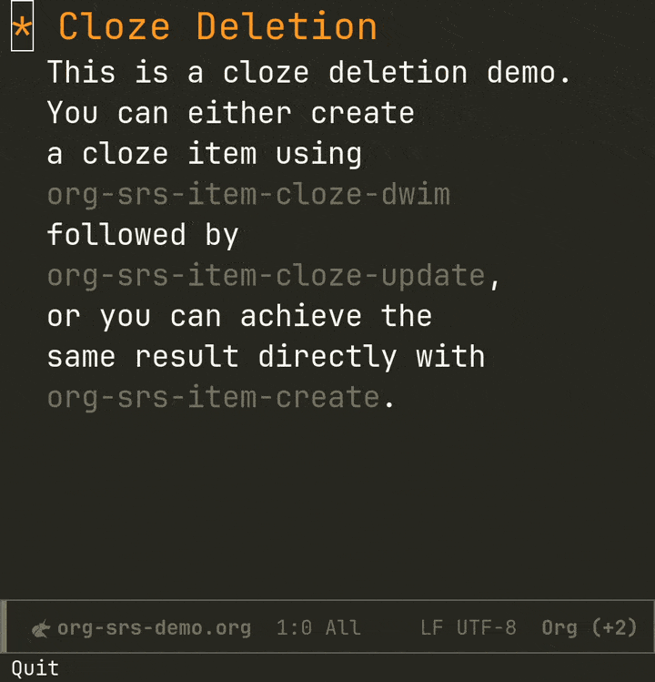
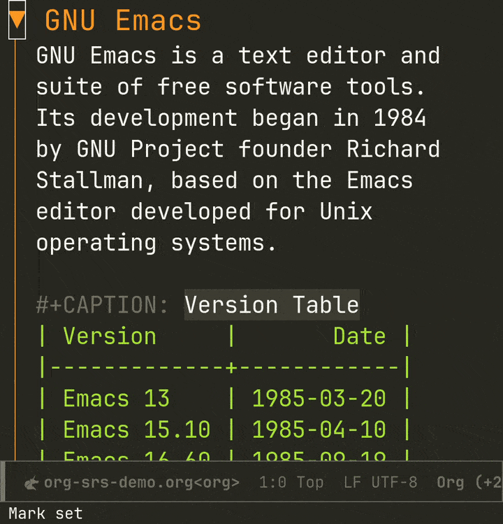

#+TITLE: Org-srs
Org Spaced Repetition System
* Introduction
Org-srs is a feature-rich and extensible spaced repetition system
integrated within Org-mode, allowing you to learn and review knowledge
without leaving your Org workflow.
* Features
- *Everything in Org* \\
  All data in Org-srs, including configurations and review records,
  are stored as plain text in your Org files. This makes version
  control easy, and by simply syncing your Org files, you can review
  seamlessly across different devices (especially the native Emacs on
  Android).
- *Flexible* \\
  In Org-srs, the smallest review unit is an "item" (similar to a card
  in Anki). A content piece reviewed through one or more items is
  called an "entry" (similar to a note in Anki). An item can be a
  flashcard with a front (question) and back (answer), a cloze
  deletion, etc. This means an entry can hold different types of items
  to meet various review needs. For example, you can review the same
  content using both flashcards and cloze deletions simultaneously if
  needed.
- *Configurable* \\
  Org-srs options can be finely controlled, allowing you to set
  different values for the same configuration option at the global,
  file, entry, or item level to suit your review preferences.
- *Extensible* \\
  Org-srs is designed to be modular. The core provides maintenance of
  review records, finding, and planning due items, without relying on
  any specific algorithm or review method. You can extend it with more
  algorithms and review methods as needed by specializing the
  corresponding generic functions.
- *Embeddable* \\
  If you're reviewing your own notes, maintaining additional entries
  for review can be tedious. If you modify your notes or add, delete,
  or modify cloze deletions, manually updating the created review
  entries can be a nightmare. Org-srs supports non-invasive embedding
  of review entries into your notes. This means that whenever you
  change the content of your notes, you can update the exported entry
  with one command, without polluting the export of your Org files. By
  using Org as the target export format, you can easily remove the
  Org-srs markers used in the process.
- *Batch Operations* \\
  You can batch-export entries that need to be reviewed using regexp,
  or batch apply cloze deletions to Org elements (e.g., tables).
- *Modern* \\
  By default, it integrates the FSRS algorithm to help you review more
  efficiently and effectively. You can also optimize the parameters
  based on the content and your review habits.
* Installation
Org-srs is currently not available on Melpa. Below is an example of
installation using Quelpa for reference. You can also choose to use
~straight.el~ or the ~:vc~ keyword in ~use-package~ (Emacs 30 and above)
according to your preference:

#+BEGIN_SRC emacs-lisp
  (use-package fsrs
    :quelpa (fsrs :fetcher github :repo "bohonghuang/lisp-fsrs")
    :defer t)

  (use-package org-srs
    :quelpa (org-srs :fetcher github :repo "bohonghuang/org-srs")
    :defer t
    :hook (org-mode . org-srs-embed-overlay-mode)
    :bind (:map org-mode-map
           ("<f5>" . org-srs-review-rate-easy)
           ("<f6>" . org-srs-review-rate-good)
           ("<f7>" . org-srs-review-rate-hard)
           ("<f8>" . org-srs-review-rate-again)))
#+END_SRC
* Usage
** Flashcards

** Cloze Deletion

** Embedding

* Configuration
** Per-folder Configuration
#+BEGIN_SRC emacs-lisp
  ;; .dir-locals.el
  ((org-mode . ((org-srs-review-new-items-per-day . 30)
                (org-srs-review-max-reviews-per-day . 100))))
#+END_SRC
** Per-file Configuration
#+BEGIN_SRC org
  :PROPERTIES:
  :SRS_REVIEW_NEW_ITEMS_PER_DAY: 30
  :SRS_REVIEW_MAX_REVIEWS_PER_DAY: 100
  :END:
  ,#+TITLE: Title

  # or:

  # Local Variables:
  # org-srs-review-new-items-per-day: 30
  # org-srs-review-max-reviews-per-day: 100
  # End:
#+END_SRC
** Per-entry Configuration
#+BEGIN_SRC org
  ,* Entry
  :PROPERTIES:
  :SRS_REVIEW_NEW_ITEMS_PER_DAY: 30
  :SRS_REVIEW_MAX_REVIEWS_PER_DAY: 100
  :END:
#+END_SRC
** Per-item Configuration
#+BEGIN_SRC org
  # Note that the following options are only provided as reference
  # examples; these two options are not valid for a single item.
  :SRSITEMS:
  ,#+NAME: srsitem:569a2e48-633d-4b8c-82b5-f3df9b29bb69::cloze::d0ee345
  ,#+ATTR_SRS: :new-items-per-day 30 :review-max-reviews-per-day 100
  | ! | timestamp            | rating | stability | difficulty | state |
  |---+----------------------+--------+-----------+------------+-------|
  |   | 2024-12-07T13:54:06Z |        |       0.0 |        0.0 | :new  |
  | * | 2024-12-07T13:54:34Z |        |           |            |       |
  :END:
#+END_SRC
